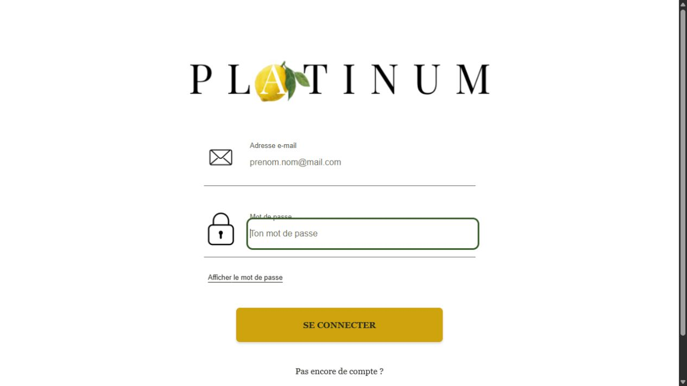
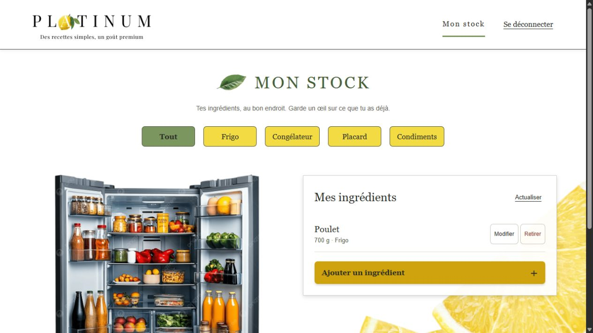
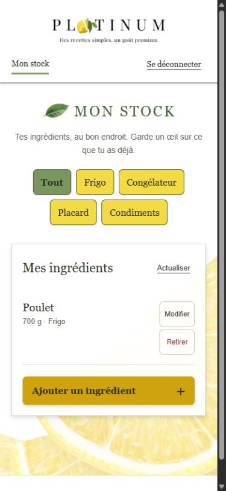

# Dossier projet Platinum

Julie Truc-Vallet · Formation Concepteur développeur d’applications · 3W Academy

Version de travail du 20 septembre 2026 · Préparation du dossier pour l’oral blanc

Platinum est une application web destinée à aider les utilisateurs à trouver quoi cuisiner avec les ingrédients qu’ils possèdent déjà. Le projet associe la gestion d’un stock personnel, un catalogue de recettes et des suggestions tenant compte des produits disponibles et des préférences alimentaires.

Cette version rassemble les éléments rédigés lors des deux premières semaines et les premières réalisations présentes dans le code. Les mentions « À compléter » identifient les travaux et preuves nécessaires avant la remise. Ce document n’est pas encore le dossier final.

## 1 Liste des compétences du référentiel couvertes par le projet

La présentation ci-dessous distingue les réalisations présentes, la conception préparée et les éléments qui restent à démontrer. Une réalisation codée ne constitue pas, à elle seule, une preuve de bon fonctionnement.

| Compétence | Éléments présents et emplacement dans le dossier | Preuve restant à apporter |
| --- | --- | --- |
| Installer et configurer son environnement de travail | Client React, serveur Express, Prisma et configuration Docker ; sections 6 et 7 | Procédure reproductible et vérification du démarrage |
| Développer des interfaces utilisateur | Connexion, inscription et stock React reliés à l’API ; section 7.11 | Recettes, suggestions et profil à réaliser |
| Développer des composants métier | Authentification, stock, recettes, préférences et suggestions ; section 7 | Parcours React restants à relier et vérifier |
| Contribuer à la gestion d’un projet informatique | Tickets GitHub, tableau Kanban et historique ; section 4 | Suivi actualisé et bilan des écarts |
| Analyser les besoins et maquetter une application | Besoins, acteurs, droits et maquettes ; sections 2 et 5 | Corrections des diagrammes et adaptations aux supports |
| Définir l’architecture logicielle d’une application | Séparation client/serveur et responsabilités du serveur ; sections 5 et 6 | Schéma d’architecture et parcours détaillé d’une requête |
| Concevoir et mettre en place une base de données relationnelle | MCD, MLD, MPD et neuf tables PostgreSQL ; section 5 | Compléter avec le diagramme de classes et les contrôles des services |
| Développer des composants d’accès aux données SQL et NoSQL | Accès SQL du stock et transactions des recettes via Prisma, vérifiés sur PostgreSQL ; section 7 | Accès NoSQL et preuve à réaliser |
| Préparer et exécuter les plans de tests d’une application | Contrôles SQL et tests HTTP du stock, des recettes et des suggestions ; sections 9 et 10 | Autres parcours et interfaces à vérifier |
| Préparer et documenter le déploiement d’une application | Environnement de développement décrit ; section 6 | Procédure de déploiement et vérifications |
| Contribuer à la mise en production dans une démarche DevOps | Travail suivi dans GitHub ; section 6 | Chaîne d’intégration et éléments de production à documenter |

À compléter : renvois aux figures et annexes définitives après réalisation et vérification des preuves.

## 2 Cahier des charges

### 2.1 Description de l’existant et problématique

De nombreux aliments présents dans les réfrigérateurs ou les placards ne sont pas utilisés faute d’idées de repas adaptées. Platinum répond à la question suivante : comment aider l’utilisateur à trouver quoi cuisiner avec les ingrédients qu’il possède afin de limiter le gaspillage alimentaire ?

L’objectif principal est de proposer des recettes pertinentes en fonction des ingrédients disponibles chez l’utilisateur. Celui-ci renseigne ses produits afin d’obtenir des suggestions réalisables immédiatement ou nécessitant un minimum de compléments. Cette approche vise à simplifier le choix des repas et à limiter les achats inutiles.

### 2.2 Reprise de l’existant

Le développement se poursuit à partir du dépôt Platinum existant. Il comprend un client React, un serveur Express, la configuration de Prisma et les premières fonctionnalités d’authentification. Les documents et maquettes des deux premières semaines servent de base à la conception détaillée. Aucune reprise de données provenant d’une application antérieure n’est décrite dans ces rendus.

### 2.3 Référencement et accès aux contenus

Les recettes publiques doivent pouvoir être consultées par un visiteur. La structure des pages devra distinguer clairement le titre de la recette, ses ingrédients et ses étapes. À compléter : objectifs de référencement retenus, titres et descriptions des pages, URLs, ainsi que les mesures effectivement mises en œuvre.

### 2.4 Performances et volumétrie

La recherche et les suggestions doivent permettre à l’utilisateur de trouver rapidement une recette. La conception doit également permettre l’évolution du catalogue. Aucun temps de réponse mesuré ni volume de référence n’est encore établi dans cette version. À compléter : taille du jeu de données, objectif de temps de réponse, conditions de mesure et résultats obtenus.

### 2.5 Publics et adaptations

Le projet s’adresse aux étudiants, jeunes actifs, familles et cuisiniers amateurs, ainsi qu’aux personnes sensibles à la réduction du gaspillage alimentaire. Les préférences alimentaires doivent permettre de personnaliser les résultats. Les contenus présentés sont en français ; une version multilingue n’est pas décrite dans le périmètre retenu.

L’application est pensée pour ordinateur, tablette et smartphone. L’approche mobile first répond notamment à un usage en cuisine. À compléter : vérifications de navigation clavier, de lisibilité, des contrastes et de comportement des formulaires.

### 2.6 Description graphique et ergonomique

Les maquettes Figma utilisent une identité visuelle autour du jaune, du vert, des aliments et du citron. Elles présentent un moteur de recherche, des cartes de recettes et des accès au profil et au stock. Le stock comporte des filtres tels que frigo, congélateur et placard. À compléter : palette et polices exactes, règles d’utilisation des composants, provenance des visuels et adaptation tablette.

### 2.7 Besoins fonctionnels métier

Trois profils sont distingués. Le visiteur découvre les recettes et effectue des recherches. L’utilisateur inscrit dispose d’un stock personnel et de préférences, et peut contribuer au catalogue. L’administrateur dispose de droits de gestion des contenus et des utilisateurs.

| Fonctionnalité attendue | Visiteur | Utilisateur inscrit | Administrateur |
| --- | --- | --- | --- |
| Consulter et rechercher des recettes publiques | Oui | Oui | Oui |
| Gérer son stock et ses préférences | Non | Oui | Oui |
| Recevoir des suggestions personnalisées | Non | Oui | Oui |
| Ajouter une recette | Non | Oui | Oui |
| Modifier ou supprimer ses recettes | Non | Oui | Oui |
| Administrer les utilisateurs et les contenus | Non | Non | Oui |

Cette matrice décrit les droits attendus. Les droits du stock et des recettes sont vérifiés côté API ; les parcours restants, dont l’administration des comptes, restent à compléter. L’inscription et la connexion permettent d’accéder aux fonctions personnelles ; elles ne donnent pas de droits d’administration.

Les contenus comprennent les recettes, ingrédients, étapes de préparation, catégories et images. L’utilisation de données externes est envisagée mais n’est pas présentée ici comme réalisée. Les données de compte sont le nom d’utilisateur, l’adresse électronique et un mot de passe conservé sous forme hachée. Les modalités d’information et de gestion des données personnelles restent à concrétiser dans l’application.

Le périmètre retenu est celui des rendus de 2026 : comptes, rôles, stock, recettes, suggestions et préférences alimentaires. Les favoris, commentaires et listes de courses de l’ancien cahier des charges ne sont pas ajoutés à cette remise.

### 2.8 Budget

Le projet est réalisé individuellement dans le cadre de la formation. À compléter : temps consacré par phase, estimation du travail restant et coûts réels des services retenus. Les salaires et budgets de l’ancien document ne sont pas repris comme dépenses du projet actuel.

## 3 Présentation du contexte de formation

Platinum est réalisé dans le cadre de ma formation Concepteur développeur d’applications à 3W Academy. Je conçois et développe l’application individuellement. Le formateur définit les livrables attendus, évalue le travail remis et formule des retours sur lesquels je m’appuie pour améliorer le projet.

Le projet mobilise l’analyse des besoins, la conception des interfaces et des données, le développement d’une API et d’un client web, puis la vérification de leur fonctionnement. Il concerne les processus de gestion des comptes, de suivi des ingrédients disponibles, de consultation des recettes et de personnalisation des suggestions.

Les objectifs et les publics sont détaillés dans le cahier des charges. Aucune entreprise commanditaire ni équipe salariée fictive n’est ajoutée à ce contexte de formation.

## 4 Gestion de projet

### 4.1 Intervenants

J’assure l’organisation du projet, la conception, le développement et la réalisation des maquettes. Le formateur représente l’interlocuteur pédagogique et apporte des retours sur les livrables. Les visiteurs, utilisateurs inscrits et administrateurs représentent les futurs profils de l’application.

### 4.2 Méthodologie

Je m’appuie sur une démarche itérative : je découpe le projet en fonctionnalités, je les réalise progressivement et je vérifie les résultats obtenus. Je m’inspire des principes de Scrum pour organiser les périodes de travail et leurs objectifs. Le projet étant individuel, cette organisation ne reproduit pas l’ensemble des rôles et cérémonies d’une équipe Scrum.

### 4.3 Outils et suivi

J’utilise Git pour conserver l’historique des modifications et GitHub pour héberger le dépôt. GitHub Projects présente les tâches dans les colonnes À faire, En cours et Terminé. Les tickets existants suivent notamment la base de données, les rôles, le stock, les recettes, les suggestions, les préférences, les tests et le déploiement.

Le ticket #15 suit l’assemblage du dossier et les preuves des compétences. Les tickets #3, #10 et #11 précisent respectivement les critères de vérification de la base, des tests et de la préparation du déploiement. Une tâche doit rester ouverte tant que ses critères ne sont pas vérifiés.

| Période prévue | Résultat recherché |
| --- | --- |
| Samedi 19 septembre | Base du dossier et consolidation du modèle de données |
| Dimanche 20 septembre | Stock, recettes, préférences et suggestions avec vérifications API |
| Lundi 21 septembre | Parcours React reliés aux fonctionnalités métier |
| Mardi 22 septembre | Tests, sécurité, veille et consolidation des preuves |
| Mercredi 23 septembre | Relecture et préparation du PDF de remise |

Le samedi, le modèle de données, les migrations et la première base du dossier ont été réalisés. Le dimanche, le CRUD du stock a été vérifié, puis celui des recettes a été développé et testé. Les préférences et le calcul des suggestions ont ensuite été vérifiés. Des branches successives sont consacrées au modèle, au stock, aux recettes puis aux suggestions ; chaque évolution repose sur la précédente. La relecture et l’intégration des propositions restent distinctes de leur publication. À compléter : les autres écarts et arbitrages, puis une capture actualisée du tableau Projects. L’échéance annoncée de remise est le jeudi 24 septembre à 17 h ; mercredi constitue l’objectif interne.

### 4.4 Objectifs de qualité

Je recherche une interface compréhensible, des données cohérentes, des accès protégés et un code organisé par responsabilités. La vérification doit accompagner chaque fonctionnalité : réaliser, tester, conserver une preuve puis rédiger l’explication correspondante. Les objectifs de qualité doivent être associés à des résultats observables dans le plan de tests.

## 5 Spécifications fonctionnelles

### 5.1 Contraintes et livrables

L’application doit être utilisable sur plusieurs tailles d’écran et réserver les données personnelles aux utilisateurs autorisés. Les principaux livrables sont le code source, les modèles de données, les maquettes, les tests et le dossier. À compléter : disponibilité attendue, dépendances effectivement retenues et conséquences de l’indisponibilité d’un service externe.

### 5.2 Architecture logicielle

Le client React et TypeScript présente les interfaces de connexion, d’inscription et de stock ; les autres pages restent à développer. Le serveur Express reçoit les requêtes HTTP et expose l’API. Ses routes orientent les appels, ses middlewares vérifient les autorisations, ses contrôleurs traitent les échanges HTTP et ses services regroupent les traitements. Prisma assure les échanges avec PostgreSQL.

Le parcours d’authentification existant suit cette organisation : route, contrôleur, service puis accès aux données avec Prisma. La même séparation doit guider les composants métier restant à développer.

### 5.3 Maquettes et enchaînement

Les maquettes préparées dans Figma comprennent l’accueil, la connexion, l’inscription, les suggestions, le profil, l’ajout et le détail d’une recette. Un écran de stock présente les ingrédients disponibles et leur rangement. L’utilisateur découvre l’application depuis l’accueil puis se connecte pour accéder à ses fonctions personnelles.

À compléter : insérer les maquettes sélectionnées sur 3 à 4 pages, la cartographie et les règles d’adaptation des écrans. Les captures des rendus initiaux doivent être relues avant réutilisation ; elles ne remplacent pas les captures de l’application développée.

### 5.4 Modèle de données

Le modèle reprend les utilisateurs, ingrédients, recettes, catégories et préférences de la semaine 1. Il distingue maintenant les ingrédients du catalogue des lignes du stock personnel. Par exemple, le riz existe une fois dans le catalogue, mais plusieurs utilisateurs peuvent en posséder des quantités différentes et le ranger à plusieurs endroits.

Le MCD ci-dessous représente les informations métier et leurs associations. Une ligne de stock concerne un seul utilisateur et un seul ingrédient. Le triplet utilisateur, ingrédient et emplacement est unique. Une recette appartient à une catégorie et peut ne pas avoir d’auteur, notamment si elle provient d’une source externe ou si son auteur a supprimé son compte.


La relation Composer porte la quantité nécessaire pour le nombre de portions de la recette. Chaque ingrédient a une unité de référence : gramme, millilitre ou pièce. Les quantités du stock et des recettes utilisent cette même unité. Cette organisation évite de comparer directement des grammes et des kilogrammes ou de mélanger une masse et un volume. Les services du stock et des recettes partagent les conversions de kilogrammes en grammes et de litres en millilitres.

Le MLD traduit les associations en tables. RecipeIngredient relie une recette à ses ingrédients et porte leurs quantités. UserPreference et RecipePreference représentent les préférences choisies par les utilisateurs et celles compatibles avec les recettes. Leurs clés composées empêchent les doublons.


Le MPD précise les types PostgreSQL et les contraintes effectivement créées. Les quantités utilisent DECIMAL(12,3) et doivent être strictement positives. Les temps peuvent être nuls ; le nombre de portions doit être positif. Les champs facultatifs sont indiqués par NULL. Les identifiants des comptes existants et les champs d’authentification sont conservés.


Les suppressions tiennent compte du rôle des données : supprimer un utilisateur retire son stock et ses préférences, mais conserve ses recettes avec un auteur nul. La suppression d’un ingrédient utilisé est refusée. Supprimer une recette retire ses associations, sans retirer les ingrédients du catalogue.


Une recette exploitable doit contenir au moins un ingrédient : le MCD indique donc 1,n. Les clés étrangères SQL garantissent l’existence des références, mais ne forcent pas une recette à avoir une ligne dans RecipeIngredient. Cette règle est maintenant vérifiée par le service de recettes, qui regroupe la recette et sa composition dans une transaction. Le contrôle des droits reste une responsabilité de l’API ; il est vérifié pour le stock et pour les écritures des recettes.

À compléter : diagramme de classes avec les contrôleurs et services, puis preuves de ces contrôles lors du développement des fonctionnalités.

### 5.5 Scripts de création et de modification

Deux migrations existent pour l’authentification. La première crée le type Role et la table User avec une contrainte d’unicité sur l’adresse électronique. La seconde remplace la colonne pseudo par username et crée une contrainte d’unicité sur username.

Cette seconde migration supprime une colonne puis ajoute une colonne obligatoire : sa présence dans l’historique ne démontre pas une reprise de données existantes. Son contexte initial reste à préciser.

La troisième migration, datée du 19 septembre 2026, ajoute les huit tables métier, leurs clés étrangères et leurs contraintes sans modifier les colonnes de User. Les contrôles CHECK sur les quantités, les portions et les durées sont ajoutés dans le script SQL, car ils ne sont pas exprimés par le schéma Prisma utilisé.

La migration a d’abord été exécutée sur une base PostgreSQL 16 isolée, après les deux migrations historiques et l’insertion d’un compte témoin. Toutes les valeurs de ce compte sont restées identiques. Après sauvegarde de la base locale de développement, la migration y a été appliquée ; la comparaison des comptes avant et après confirme également leur conservation. Les trois migrations sont à jour et le client Prisma a été régénéré.

Un script de démonstration contient six ingrédients et deux recettes. Son exécution deux fois sur la base de test n’a produit aucun doublon. Il ne crée pas de compte et n’a pas été chargé dans la base de développement. Les scripts et les résultats sont conservés dans le dépôt, avec la proposition de modification #16.

### 5.6 Diagramme de cas d’utilisation

Le diagramme global relie les profils aux fonctions décrites dans la matrice des droits. À compléter : reprendre le diagramme de semaine 1, vérifier le sens des relations include et distinguer les fonctions publiques des fonctions nécessitant une connexion.

### 5.7 Fonctionnalités détaillées

Renseigner ses ingrédients permet à l’utilisateur inscrit d’enregistrer les produits qu’il possède. Les informations à préciser sont l’ingrédient, la quantité, l’unité et, selon le modèle retenu, son emplacement. L’utilisateur ne doit agir que sur son propre stock.

Recevoir des suggestions permet de rapprocher ce stock des ingrédients nécessaires aux recettes. Le résultat doit présenter les recettes pertinentes et les ingrédients manquants. La règle de calcul et le traitement des préférences sont maintenant décrits et vérifiés en sections 7.9, 7.10 et 10.

Rechercher des recettes par ingrédients permet une recherche manuelle sans dépendre exclusivement des suggestions personnelles. Les critères saisis, les contrôles et les résultats attendus doivent être précisés.

Consulter la compatibilité permet d’identifier les ingrédients disponibles et manquants pour une recette. Les niveaux visuels de semaine 1 sont précisés par les seuils de la section 7.10. Les quantités sont comparées dans leur unité de référence ; les cas limites sont vérifiés en section 10.

Pour ces quatre fonctionnalités, reprendre et corriger les diagrammes d’activité et de séquence, puis détailler les entrées, traitements, sorties et contrôles. Les séquences doivent rendre visibles les couches du serveur.

## 6 Spécifications techniques

### 6.1 Environnement technique

| Technologie présente | Utilisation dans Platinum |
| --- | --- |
| React, TypeScript et Vite | Initialisation du client et développement prévu des interfaces |
| Node.js, Express et TypeScript | Serveur et API organisés par responsabilités |
| PostgreSQL et Prisma | Stockage relationnel et accès aux données |
| bcrypt | Hachage et vérification des mots de passe |
| jsonwebtoken | Création et vérification des jetons d’authentification |
| Docker | Configuration de PostgreSQL dans l’environnement de développement |
| Git, GitHub et GitHub Projects | Versions et suivi des tâches |
| Figma | Conception des maquettes |

Ces choix reprennent les technologies travaillées pendant la formation et la séparation client/serveur décrite en semaine 2. À compléter : versions réellement installées, raisons de leur choix et contraintes. Les outils annoncés en semaine 1 mais non constatés dans le projet, tels que Swagger, Jest, Vitest ou Jenkins, ne sont pas présentés comme opérationnels.

### 6.2 Navigation et accessibilité

La cartographie doit être traduite en routes du client et en navigation utilisable sur mobile, tablette et ordinateur. À compléter : URLs réelles, gestion des pages protégées, messages d’erreur, compatibilité des navigateurs et résultats des vérifications d’accessibilité.

### 6.3 Services tiers et référencement

Les rendus envisagent des données externes pour compléter les ingrédients ou recettes. Aucun service de ce type n’est décrit comme intégré dans le code actuel. À compléter : décision sur leur utilisation, limites et gestion des erreurs. Les éléments de référencement réellement développés seront rattachés aux objectifs de la section 2.

### 6.4 Sécurité et configuration

Le serveur utilise des variables d’environnement pour sa configuration. Le secret JWT et l’URL de connexion à la base doivent être documentés par leur rôle, sans publier leurs valeurs. Les contrôles d’accès sont détaillés dans la section 8.

### 6.5 Préparation du déploiement et démarche DevOps

À compléter : prérequis, commandes de build et de démarrage, configuration de production, migrations, sauvegarde, restauration, contrôle du service et retour arrière. L’utilisation de GitHub pour le code ne constitue pas à elle seule une chaîne d’intégration ou de déploiement continu. Les opérations exécutées et leurs résultats seront distingués des étapes seulement préparées.

## 7 Réalisations

### 7.1 Organisation du projet

J’ai organisé le projet en deux dossiers : client pour l’interface et server pour l’API. Le serveur sépare routes, contrôleurs, services, middlewares et configuration. Le dossier Prisma contient le schéma de données et l’historique des migrations.

### 7.2 Inscription et connexion

J’ai développé les routes POST /api/auth/register et POST /api/auth/login. À l’inscription, le contrôleur transmet le nom d’utilisateur, l’adresse électronique et le mot de passe au service. Le service recherche un compte existant avec la même adresse ou le même nom, hache le mot de passe avec bcrypt puis crée le compte avec Prisma. La réponse contient l’identifiant, le nom, l’adresse et le rôle, sans le mot de passe haché.

Lors de la connexion, le service recherche le compte par son adresse électronique et compare le mot de passe transmis à son empreinte enregistrée. Si la comparaison réussit, il crée un JWT contenant l’identifiant et le rôle, avec une durée de validité d’une heure. Le service renvoie le jeton et les informations utiles du compte.

### 7.3 Contrôle des accès

J’ai ajouté un middleware qui récupère le jeton dans l’en-tête Authorization au format Bearer et vérifie sa validité. Le middleware contrôle la signature HS256, l’expiration et l’identifiant, puis recherche le compte en base. GET /api/auth/me renvoie son identifiant et son rôle courant. Un compte supprimé ne peut plus utiliser son ancien jeton. Un second middleware vérifie que le rôle appartient aux rôles autorisés ; la route /api/auth/admin-test en fournit un premier exemple réservé à ADMIN.

Les tests HTTP du stock passent par une inscription et une connexion réelles. Ils vérifient aussi les jetons absents, invalides ou expirés, le compte supprimé et le refus d’un ancien jeton administrateur pour un compte actuellement USER. À compléter : les autres cas de validation des formulaires d’authentification et les captures des parcours.

### 7.4 Mise en place du modèle métier

Le schéma Prisma comprend maintenant neuf modèles. La migration crée les relations nécessaires au stock, aux recettes et aux préférences. Les contraintes et les suppressions ont été vérifiées avec 22 contrôles SQL réussis sur une base isolée. Cette étape vérifie la cohérence du stockage. Les routes du stock, des recettes, des préférences et des suggestions font l’objet des vérifications HTTP décrites ci-dessous. Les interfaces de connexion et stock sont reliées à ces routes. Les autres pages restent à réaliser.

Les fichiers de référence sont server/prisma/schema.prisma, la migration 20260919110000_add_recipe_stock_preferences, server/prisma/tests/constraints.sql et docs/verification-base-2026-09-19.txt. Les choix du modèle sont expliqués dans docs/modele-donnees.md et les trois niveaux de représentation figurent en section 5.4.

### 7.5 Gestion du stock personnel

Le stock permet à un utilisateur connecté de renseigner les ingrédients qu’il possède. Les opérations sont exposées par l’API ; l’interface React n’est pas encore construite. Le catalogue d’ingrédients est partagé, mais les quantités et les emplacements appartiennent à chaque utilisateur.

| Opération | Route et résultat |
| --- | --- |
| Choisir un ingrédient | GET /api/ingredients : recherche par nom et pagination |
| Consulter son stock | GET /api/stock : liste, avec filtre facultatif par emplacement |
| Consulter une ligne | GET /api/stock/:id : ligne du compte connecté |
| Ajouter au stock | POST /api/stock : ligne créée, HTTP 201 |
| Modifier la quantité ou l’emplacement | PATCH /api/stock/:id : ligne mise à jour, HTTP 200 |
| Supprimer une ligne | DELETE /api/stock/:id : suppression, HTTP 204 |

À l’ajout, l’utilisateur choisit un ingrédient existant, une quantité, une unité et un emplacement. Le serveur prend l’identité dans le compte authentifié ; il refuse un userId fourni dans le corps de la requête. Ajouter le même ingrédient au même emplacement donne un conflit HTTP 409 : il faut modifier la ligne existante. Une modification remplace la quantité totale, sans addition automatique.

Le service vérifie les valeurs avant l’écriture. Une quantité doit être positive et comporter au maximum trois décimales. Les kilogrammes sont convertis en grammes et les litres en millilitres avec Prisma Decimal, sans calcul flottant intermédiaire. Une unité incompatible est refusée. Une quantité nulle n’efface pas silencieusement la ligne : la suppression utilise sa propre route.

Exemple : une saisie de 0,5 kg de riz produit une quantité enregistrée de 500 g. Une modification à 0,125 kg remplace cette valeur par 125 g. L’unité de référence reste attachée à l’ingrédient du catalogue.

### 7.6 Protection des données du stock

Le contrôleur transmet au service l’identifiant du compte connecté et celui de la ligne demandée. La condition de propriétaire est présente dans la requête d’écriture elle-même. Une lecture préalable ne serait pas suffisante pour protéger les autres chemins de modification.

Extrait de server/src/services/stock.service.ts :

```typescript
return prisma.stockItem.update({
  where: { id, userId },
  data: { quantity, location },
  include: withIngredient,
});
```

Ici, userId vient du middleware d’authentification. Si la ligne n’appartient pas à ce compte, Prisma ne trouve aucune ligne correspondant aux deux critères. Le serveur renvoie 404, comme pour une ligne inexistante. La suppression utilise la même condition. La liste est également filtrée par propriétaire.

La contrainte unique en base complète ces contrôles. Deux ajouts simultanés du même ingrédient au même emplacement donnent une seule création et un conflit ; ils ne produisent pas deux lignes. Une tentative de déplacement vers un emplacement déjà occupé est refusée sans modifier la quantité ni l’emplacement d’origine.

Les fichiers server/tests/stock.test.cjs et docs/verification-stock-2026-09-20.txt contiennent les scénarios et leur exécution. Le contrat détaillé de l’API se trouve dans docs/api-stock.md.

### 7.7 Consultation et recherche de recettes

Les routes GET /api/recipes et GET /api/recipes/:id permettent de consulter les recettes sans connexion. La liste présente le titre, l’image éventuelle, les portions, les durées, la difficulté, la catégorie et le nom de l’auteur. Le détail ajoute les instructions, la source éventuelle et les ingrédients avec leurs quantités. L’adresse électronique et le mot de passe de l’auteur ne sont jamais sélectionnés pour ces réponses publiques.

La recherche porte sur le titre ou le nom d’un ingrédient, sans distinction de casse. Elle peut être combinée à une catégorie et à une liste d’ingrédients : dans ce dernier cas, la recette doit contenir tous les ingrédients demandés. Il s’agit d’une recherche dans le catalogue. La vérification du stock personnel est assurée séparément par les suggestions.

La liste est paginée avec vingt recettes par défaut et cent au maximum. Le tri utilise la date de création puis l’identifiant pour conserver un ordre stable. Le total et la page de résultats sont lus dans une transaction au niveau REPEATABLE READ, pour utiliser un même instantané des données.

### 7.8 Création et modification d’une recette

Un utilisateur connecté peut créer une recette avec POST /api/recipes. Le serveur attribue automatiquement son compte comme auteur. Le corps contient le titre, les instructions, la catégorie, les portions, les durées et entre un et cent ingrédients distincts. Les ingrédients et la catégorie doivent exister dans le catalogue. Les quantités utilisent les mêmes contrôles et conversions que le stock.

PUT /api/recipes/:id reçoit une recette complète et remplace ses champs ainsi que sa composition. Les quantités correspondent au nombre de portions envoyé ; un changement de portions ne les recalcule pas implicitement. Le service vérifie la présence d’au moins un ingrédient avant toute écriture.

L’enregistrement est transactionnel. Si l’ajout d’un ingrédient échoue, la création entière est annulée. Lors d’une modification, les changements de titre et de composition sont eux aussi annulés ensemble en cas d’échec : la recette précédente reste utilisable.

Extrait de server/src/services/recipe.service.ts, dans la transaction de remplacement :

```typescript
return tx.recipe.update({
  where: writable(id, account),
  data: {
    ...fields,
    ingredients: { deleteMany: {}, create: rows },
    preferences: { deleteMany: {} },
  },
  select: detail,
});
```

La condition writable contient l’identifiant de la recette et celui de son auteur pour un compte USER ; ADMIN peut intervenir sur toute recette. L’auteur d’origine est conservé lors d’une modification par l’administration. Une recette sans auteur reste publique, mais seul ADMIN peut la gérer.

Les anciennes étiquettes de compatibilité alimentaire sont retirées lors d’un remplacement complet, car la composition peut avoir changé. Leur confirmation est maintenant traitée par la route dédiée aux préférences de la recette, avec contrôle de sa version. Le futur formulaire devra expliquer cette réinitialisation.

Les transactions de création et de remplacement utilisent le niveau SERIALIZABLE. En cas de conflit simultané, le serveur peut répondre 409 et demander une actualisation. Les tests vérifient que la composition finale est complète et ne mélange pas les ingrédients de deux modifications. Cette protection n’empêche pas encore qu’un formulaire ancien soit envoyé plus tard : aucun verrou de version n’est implémenté pour le remplacement complet. La confirmation des étiquettes alimentaires dispose, elle, du contrôle décrit ci-dessous.

DELETE /api/recipes/:id est réservé à l’auteur ou à ADMIN. Les associations de la recette sont supprimées, mais les ingrédients du catalogue restent présents. Les erreurs de validation retournent 400 ; une recette inexistante ou non modifiable par ce compte retourne 404.

Les fichiers server/tests/recipes.test.cjs, docs/api-recettes.md et docs/verification-recettes-2026-09-20.txt conservent le contrat et les preuves d’exécution.

### 7.9 Préférences alimentaires personnelles

GET /api/preferences présente le catalogue des préférences. Un utilisateur connecté consulte ses choix avec GET /api/preferences/me et les remplace avec PUT sur cette même route. Le corps contient seulement preferenceIds, une liste de vingt identifiants distincts au maximum. Une liste vide retire les choix. Les références sont contrôlées avant l’écriture transactionnelle ; un champ userId envoyé par le client est refusé.

Les étiquettes d’une recette sont confirmées par son auteur ou un administrateur avec PUT /api/recipes/:id/preferences. La demande contient la version updatedAt obtenue à la lecture de la recette. Si elle a changé, le serveur refuse la confirmation avec 409 et demande de relire la composition. Les étiquettes sont déclaratives : elles ne résultent pas d’une détection automatique des allergènes. Modifier complètement une recette retire ses anciennes étiquettes.

### 7.10 Suggestions à partir du stock

GET /api/suggestions utilise le compte authentifié pour lire ses préférences et son stock. Les quantités d’un même ingrédient sont additionnées entre les rangements. Les recettes doivent porter toutes les préférences choisies et contenir au moins un ingrédient. En l’absence de préférence, aucun filtre alimentaire n’est appliqué. Une étiquette absente ne signifie pas que la recette est compatible.

Le calcul utilise les quantités prévues pour les portions de chaque recette. Pour chaque ingrédient, le manque est la différence positive entre le besoin et le stock. Le serveur indique si le stock est suffisant, partiel ou absent. Les quantités sont comparées avec Decimal afin de conserver la précision des valeurs enregistrées.

Le score est le pourcentage d’ingrédients disponibles en quantité suffisante. Il ne mélange pas les grammes, les millilitres et les pièces. Les seuils précisent les niveaux qualitatifs de la semaine 1 : vert si plus de la moitié des ingrédients sont suffisants, orange si au moins un l’est sans dépasser la moitié, rouge si aucun ne l’est. Le champ canCook indique séparément si tous les ingrédients sont suffisants. Une majorité ne suffit donc pas à déclarer la recette réalisable.

Extrait de server/src/services/suggestion.service.ts :

```typescript
const available = quantities.get(row.ingredient.id)
  ?? new Prisma.Decimal(0);
const missing = Prisma.Decimal.max(
  row.quantity.minus(available), 0
);
```

Les recettes sont triées par proportion exacte décroissante, puis par nombre d’ingrédients à compléter et identifiant. L’arrondi du score sert uniquement à l’affichage. La pagination intervient après le tri : vingt résultats par défaut et cent maximum. Les préférences, le stock et les recettes sont lus dans un même instantané REPEATABLE READ. Une consultation ne modifie pas les quantités du stock.

La première version classe en mémoire toutes les recettes compatibles. Ce choix est adapté au petit catalogue du projet, mais devra être mesuré et revu pour une volumétrie importante. Elle ne recalcule pas encore les portions à la demande. Le contrat complet figure dans docs/api-suggestions.md.

### 7.11 Interfaces React de connexion et de stock

Le client initialisé avec Vite a été remplacé par un premier parcours fonctionnel. L’utilisateur peut créer un compte, se connecter et consulter son stock. Les formulaires reprennent le logo et les boutons jaunes des maquettes Figma. Des étiquettes visibles et des messages de retour ont été ajoutés pour rendre les actions compréhensibles.

L’inscription appelle POST /api/auth/register. Après confirmation, l’utilisateur se connecte avec POST /api/auth/login. Le jeton est conservé dans sessionStorage pour permettre l’actualisation de l’onglet, puis vérifié avec GET /api/auth/me. Le code ne conserve pas le mot de passe. Si une requête protégée répond 401, le client retire le jeton et demande une nouvelle connexion. Une indisponibilité du serveur propose de réessayer.



L’écran de stock propose les filtres Tout, Frigo, Congélateur, Placard et Condiments. Il lit les données de GET /api/stock et affiche les quantités dans leurs unités de référence. L’ajout utilise un catalogue recherché et paginé. Le formulaire accepte une virgule décimale, propose les unités compatibles et laisse le serveur effectuer les conversions.



Une écriture n’est présentée comme réussie qu’après la réponse de l’API. L’ajout et la modification reprennent la ligne enregistrée renvoyée par le serveur. Un doublon affiche le message de refus dans le formulaire, sans perdre les valeurs. Le retrait comporte une confirmation et une possibilité d’annuler.

Sous 800 px, le frigo décoratif est masqué pour donner la priorité à la liste. Les filtres passent à la ligne. Le formulaire reste accessible dans une fenêtre dialog avec un titre et des libellés. La fermeture par Échap rend le focus au bouton qui l’a ouvert ; ce comportement a été corrigé puis vérifié pendant les essais. Les erreurs et confirmations utilisent les rôles alert et status. Ces vérifications ne constituent pas un audit d’accessibilité complet.



App.tsx gère la session ; AuthPage.tsx contient les formulaires d’authentification ; StockPage.tsx présente la liste ; StockForm.tsx gère le formulaire d’ajout et de modification. lib/api.ts centralise les appels HTTP et les erreurs. Les lectures sont annulées si leur écran disparaît ou si la recherche change. Le client appelle /api sur la même origine ; le proxy Vite redirige les demandes vers Express pendant le développement.

Les images sont les exports des maquettes, stockés localement pour éviter les liens temporaires. Leur droit d’utilisation final reste à documenter, en conservant les éventuels filigranes d’origine. Georgia et Arial remplacent provisoirement Playfair Display et Inter. Les couleurs principales sont reprises des maquettes ; le titre vert est foncé pour rester lisible. Le parcours de récupération de mot de passe n’est pas exposé avant son implémentation serveur.

### 7.12 Réalisations restantes

Les écrans des recettes, des suggestions et du profil restent à relier aux API déjà disponibles. L’accès NoSQL, la préparation de production et les éléments de sécurité restants doivent être réalisés et vérifiés. Les captures ci-dessus documentent uniquement les parcours de connexion et stock déjà exécutés.

## 8 Éléments de sécurité de l’application

Le code actuel hache les mots de passe avec bcrypt et ne renvoie pas leur empreinte dans la réponse d’inscription. La connexion utilise une comparaison bcrypt et produit un JWT. Les middlewares permettent de refuser un accès sans jeton valide ou avec un rôle non autorisé.

Les rôles USER et ADMIN sont définis dans Prisma, avec USER comme valeur par défaut. Le rôle ne fait pas partie des champs transmis par la route d’inscription au service, ce qui évite de proposer l’attribution d’un rôle administrateur dans ce parcours.

Les routes du stock refusent les champs inattendus, notamment userId, les quantités invalides et les unités incompatibles. Chaque requête utilise l’identité du compte authentifié. L’identifiant et le rôle sont typés ; le rôle est relu en base. Les erreurs internes ne renvoient pas de détails SQL. À compléter : validation approfondie des formulaires d’authentification, configuration des échanges avec le client, gestion des secrets en production et contrôles des futures routes.

Les tests HTTP vérifient ces protections avec deux comptes distincts. Les accès au stock d’un autre compte sont refusés avec le même code 404 qu’une ligne inexistante, sans divulguer son contenu.

## 9 Plan de tests

Le plan doit vérifier les fonctionnalités attendues et les refus nécessaires. Les données initiales, les actions, les résultats attendus et les résultats obtenus seront conservés pour rendre les vérifications reproductibles.

| Scénario préparé | Résultat attendu | État de la preuve |
| --- | --- | --- |
| Inscription avec données valides | Compte créé, rôle USER et absence du mot de passe dans la réponse | Vérifié lors de la préparation des tests HTTP |
| Adresse ou nom déjà utilisé | Création refusée | À exécuter et documenter |
| Connexion correcte puis incorrecte | Accès dans le premier cas, refus dans le second | Les deux cas sont vérifiés depuis le navigateur ; section 9.4 |
| Route protégée sans jeton ou avec jeton invalide | Accès refusé | HTTP 401 vérifié sur stock et catalogue |
| Route administrateur avec un compte USER | Accès refusé | HTTP 403 vérifié, même avec un ancien rôle ADMIN dans le jeton |
| Lecture, modification ou suppression du stock d’un autre compte | Accès refusé, données inchangées | HTTP 404 et maintien de la quantité vérifiés |
| Recette, stock et préférences cohérents | Suggestions conformes aux règles définies | Calculs, filtres et isolation vérifiés ; voir section 10 |
| Navigation sur plusieurs supports et au clavier | Contenus et actions utilisables | Interfaces à développer |

Le tableau ci-dessus reste un plan de vérification des parcours applicatifs. En complément, 22 contrôles ont été exécutés avec succès sur PostgreSQL 16 le 19 septembre 2026 : refus des quantités invalides et des doublons, respect des références, contrôles des portions et des temps, suppressions en cascade et conservation des recettes sans auteur. Les données de ce test ont été annulées par ROLLBACK. La trace d’exécution est conservée dans docs/verification-base-2026-09-19.txt.

Les vérifications SQL du 19 septembre sont complétées par la suite HTTP du stock du 20 septembre, décrite ci-dessous. Les recettes sont également vérifiées par la suite de tests décrite en section 9.2. La section 9.3 complète ces preuves pour les préférences et les suggestions. Les premiers parcours visuels sont vérifiés en section 9.4 ; les autres pages restent à tester.

### 9.1 Vérification HTTP du stock

Les tests lancent l’application sur un port local temporaire et utilisent une base PostgreSQL 16 séparée, appelée platinum_stock_test. Les trois migrations sont appliquées avant les essais. Les comptes sont créés par les routes d’inscription et de connexion ; les appels passent ensuite par HTTP, le middleware, les contrôleurs, les services et PostgreSQL. Le fichier de test refuse une base ne portant pas ce nom ou un hôte non local. Le conteneur est supprimé à la fin ; la base de développement n’est pas utilisée.

| Essai | Résultat attendu et observé |
| --- | --- |
| Ajouter 0,5 kg de riz | HTTP 201 ; quantité renvoyée « 500 », unité GRAM |
| Remplacer par 0,125 kg et déplacer au frigo | HTTP 200 ; quantité « 125 » et emplacement FRIDGE |
| Filtrer par emplacement | La ligne déplacée apparaît au frigo et plus au placard |
| Lire, modifier ou supprimer depuis le second compte | HTTP 404 ; quantité du premier compte conservée |
| Envoyer un userId dans le corps | HTTP 400 ; champ non autorisé |
| Créer deux fois le même produit au même endroit | HTTP 409 au second ajout |
| Envoyer deux ajouts simultanés | Une réponse 201 et une réponse 409 |
| Déplacer vers un emplacement déjà occupé | HTTP 409 ; données de la ligne inchangées |
| Saisir zéro, une valeur négative ou trop précise | HTTP 400, sans arrondi silencieux |
| Mélanger litres et grammes | HTTP 400 ; unité incompatible |
| Utiliser un jeton expiré ou un compte supprimé | HTTP 401 |
| Supprimer sa propre ligne puis la relire | HTTP 204 puis HTTP 404 |

Le lanceur Node compte 29 tests réussis, sans échec ni test ignoré : neuf scénarios principaux et vingt sous-cas. Le bilan de l’exécution du 20 septembre est conservé dans la trace, avec les résultats de chaque scénario. Ces tests vérifient les opérations du stock et certains parcours d’authentification ; ils ne remplacent pas les essais des interfaces ni la suite dédiée aux suggestions.

### 9.2 Vérification HTTP des recettes

La suite des recettes utilise une autre base dédiée, platinum_recipes_test, avec PostgreSQL 16 et les trois migrations. Les comptes d’essai sont créés par HTTP. Un rôle administrateur est attribué uniquement dans cette base de test, afin de comparer les droits du visiteur, de l’auteur, d’un autre utilisateur et de l’administration.

| Essai | Résultat observé |
| --- | --- |
| Consulter sans jeton | Liste, catégories et détail accessibles, sans adresse électronique de l’auteur |
| Rechercher par titre, ingrédient ou catégorie | Résultats conformes aux critères et pagination stable |
| Filtrer sur deux ingrédients | Seules les recettes contenant les deux sont retournées |
| Créer sans connexion | HTTP 401 |
| Créer avec 0,2 kg de riz et 0,4 litre d’eau | HTTP 201 ; 200 g et 400 ml pour les portions déclarées |
| Modifier ou supprimer la recette d’un autre utilisateur | HTTP 404 ; recette inchangée |
| Administrer une recette d’un autre auteur | Modification et suppression autorisées ; auteur conservé lors de la modification |
| Supprimer le compte auteur | Recette publique conservée, auteur nul ; gestion réservée à ADMIN |
| Envoyer une recette vide, un doublon ou une référence inconnue | HTTP 400 ; aucune création partielle |
| Provoquer une erreur SQL pendant une création | HTTP 500 générique ; aucune recette ajoutée |
| Provoquer une erreur SQL pendant un remplacement | Recette initiale intégralement conservée |
| Envoyer deux remplacements simultanés | Composition finale complète ; succès ou conflit explicite, sans mélange |
| Supprimer une recette | Associations supprimées et catalogue conservé |

Pour vérifier l’annulation réelle, le test ajoute temporairement une contrainte SQL qui refuse une quantité pourtant valide pour l’application. Cette panne intervient après les validations métier. Le test compare ensuite le titre, les dates et les ingrédients à leur état initial, puis retire la contrainte. Le conteneur est supprimé à la fin de la vérification.

Le bilan du 20 septembre compte 30 tests réussis, sans échec ni test ignoré : douze scénarios principaux et dix-huit sous-cas. La trace se trouve dans docs/verification-recettes-2026-09-20.txt. Les 29 tests du stock ont aussi été relancés après cette évolution et restent tous réussis. Ces résultats concernent l’API ; la section 9.4 distingue les essais effectués sur les premiers écrans.

### 9.3 Vérification HTTP des préférences et suggestions

La suite server/tests/suggestions.test.cjs utilise la base PostgreSQL 16 isolée platinum_suggestions_test, après application des trois migrations. Les requêtes passent par HTTP et utilisent des comptes créés par les routes d’authentification. Le 20 septembre 2026, les douze scénarios et treize sous-cas ont donné 25 tests réussis, sans échec ni test ignoré. La trace est conservée dans docs/verification-suggestions-2026-09-20.txt.

Les essais couvrent l’accès au catalogue, la confidentialité des choix, leur remplacement et leur effacement, le refus des références invalides sans perte des choix précédents et les écritures simultanées. Les droits d’étiquetage sont testés pour l’auteur, un autre compte et l’administration. Une version ancienne est refusée et un changement de composition efface les étiquettes.

Les suggestions sont vérifiées avec un stock réparti entre plusieurs rangements, un stock vide, un manque de 0,001 g et plusieurs préférences cumulées. Les tests contrôlent aussi le tri avant pagination, l’exclusion d’une recette vide et l’absence de consommation du stock à la consultation. Ils ne constituent pas un test de charge ni une validation des écrans.

### 9.4 Essais des interfaces dans le navigateur

Le 20 septembre, les premiers écrans ont été testés dans le navigateur intégré avec la vraie API et une base PostgreSQL 16 temporaire nommée platinum_ui_test. Les trois migrations et le catalogue de démonstration ont été appliqués. Deux comptes fictifs distincts ont été créés depuis le formulaire. La base de développement et son fichier .env n’ont pas été modifiés.

| Parcours | Résultat attendu | Résultat observé |
| --- | --- | --- |
| Créer un compte puis se connecter | Confirmation puis accès au stock personnel | Conforme |
| Envoyer un mauvais mot de passe | Refus sans accès au stock | Message d’identifiants incorrects |
| Ajouter 0,5 kg de riz au placard | 500 g enregistrés et affichés | Conforme |
| Saisir zéro ou un doublon | Refus sans perte de la saisie | Messages explicites ; formulaire conservé |
| Modifier en 0,125 kg et déplacer au frigo | 125 g au frigo ; placard vide | Conforme dans les deux filtres |
| Actualiser la page | Session et stock conservés | 125 g retrouvés au frigo |
| Annuler puis confirmer un retrait | Conservation puis suppression de la ligne | Conforme |
| Se connecter avec le second compte | Aucun produit du premier compte | Stock vide |
| Invalider ce compte dans la base de test | Retour à la connexion lors de la prochaine demande | Jeton retiré et message de session expirée |
| Fermer le formulaire mobile par Échap | Retour du focus au bouton de modification | Conforme après correction |

Le stock a été inspecté au format ordinateur et avec un viewport mobile de 390 × 844 px. Les images se chargent et aucun débordement horizontal n’a été constaté. Les captures sont conservées dans docs/captures et la trace détaillée dans docs/verification-interface-2026-09-20.md. La compilation du client et son contrôle ESLint réussissent.

Ces parcours observés sont distincts des 84 tests HTTP automatisés existants. Les essais multi-navigateurs, de panne réseau, de catalogue volumineux et d’accessibilité complète restent à effectuer, ainsi que ceux des pages restantes. Cette tranche ne modifie pas le serveur : les suites API ne sont pas présentées comme réexécutées à cette occasion.

## 10 Jeu d’essai de la fonctionnalité la plus représentative

La suggestion de recettes représente l’objectif anti-gaspillage de Platinum. Le jeu d’essai ci-dessous relie les ingrédients enregistrés, le stock personnel, les préférences et le résultat du service. Il a été exécuté sur l’API le 20 septembre 2026 ; la démonstration visuelle reste à ajouter après le développement des écrans.

### 10.1 Données initiales

La recette « Riz carottes » est prévue pour deux personnes : 200 g de riz et 100 g de carotte. Une seconde recette d’essai demande 200 ml d’eau. Le premier compte possède 150 g de riz au placard, 50 g au frigo et 60 g de carotte au frigo. Un second compte possède 900 g de carotte. Un troisième compte n’a aucun stock. Les préférences végétarien et végétalien sont présentes dans le catalogue.

Le scénario fait évoluer ces données entre les essais et remet la carotte à 60 g après le contrôle des quantités. Les comptes et recettes sont fictifs et réservés à la base de test. La base de développement n’est pas utilisée.

### 10.2 Résultats attendus et obtenus

| Action et entrée | Résultat attendu | Résultat obtenu |
| --- | --- | --- |
| Consulter les suggestions avec le premier stock | Riz : 200 g suffisants ; carotte : manque 40 g ; score 50 %, orange, non réalisable | Conforme, HTTP 200 ; riz avant la recette d’eau |
| Examiner la recette d’eau sans eau en stock | Manque 200 ml ; score 0 %, rouge | Conforme, statut ABSENT |
| Consulter depuis le compte au stock vide | Deux recettes à 0 %, aucune réalisable | Conforme ; recette vide exclue |
| Porter la carotte à 99,999 g | Manque 0,001 g ; recette non réalisable | Conforme, sans arrondi masquant le manque |
| Porter la carotte à 100 g | Tous les ingrédients suffisants ; 100 %, vert et réalisable | Conforme, canCook vrai |
| Choisir végétarien et végétalien ; recette portant seulement végétarien | Aucun résultat compatible | Conforme, total égal à zéro |
| Confirmer les deux étiquettes sur Riz carottes | Cette recette seule ; score toujours 50 % avec 60 g de carotte | Conforme ; deux préférences appliquées |

Le test vérifie également que les 900 g de carotte du second compte ne complètent pas le stock du premier. Deux consultations successives laissent les lignes de stock strictement identiques. Ces contrôles montrent que la suggestion repose sur les données du bon utilisateur et reste une opération de lecture.

## 11 Veille sur les vulnérabilités de sécurité

La veille doit porter sur les technologies effectivement utilisées dans Platinum et aboutir à des décisions vérifiables. Le guide veilleTechnique.md apporte une méthode de collecte et d’organisation, mais ne constitue pas le compte rendu d’une veille réalisée pour le projet.

À compléter : date de consultation, source, technologie et version concernées, risque recherché, résultat de l’analyse, décision et vérification d’un éventuel correctif. La rédaction finale devra décrire à la première personne les recherches réellement effectuées. L’absence de vulnérabilité confirmée ne doit pas être présentée comme une garantie de sécurité.

## Références et annexes à constituer

Documents de base : Projet Semaine 1 - Julie Truc-Vallet.pdf ; Projet Semaine 2 - Julie Truc-Vallet.pdf ; gabarit_dossier_projet (1).pdf ; référentiel CDA millésime 04 de 2023 fourni ; consignes et retours B3PROJET1 et B3PROJET2_1.

Dépôt : https://github.com/JulieTrucVallet/platinum

Suivi du dossier : https://github.com/JulieTrucVallet/platinum/issues/15

Maquettes : https://www.figma.com/design/35jm2eGMTuwXBFyl6bJNUF/Maquettes-Platinum

À compléter : diagrammes UML, captures, extraits de code et preuves des fonctionnalités restantes.
