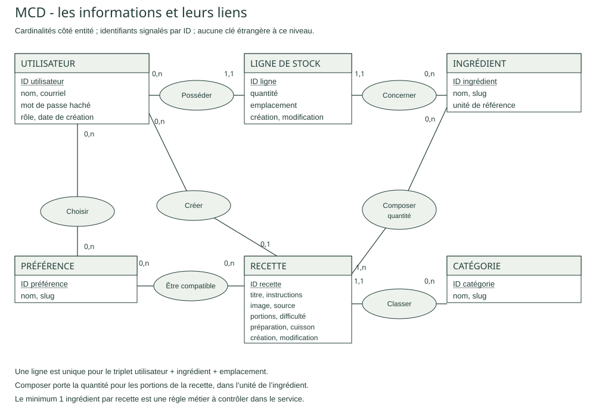
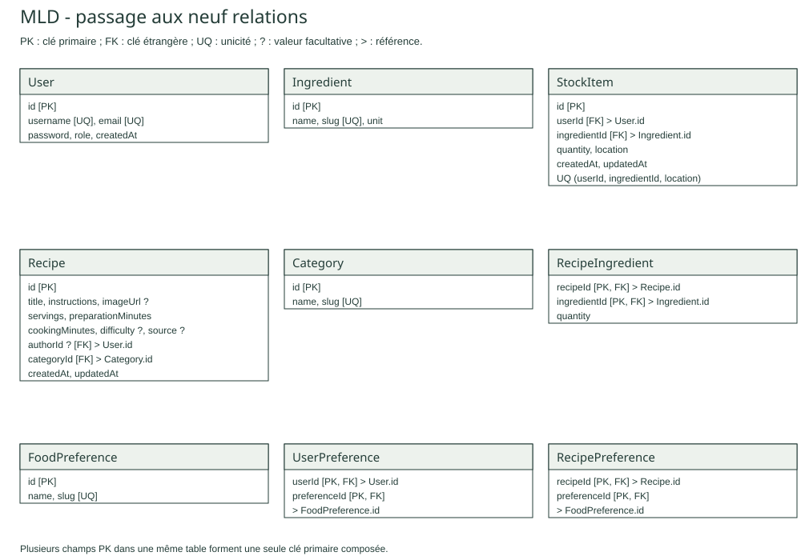
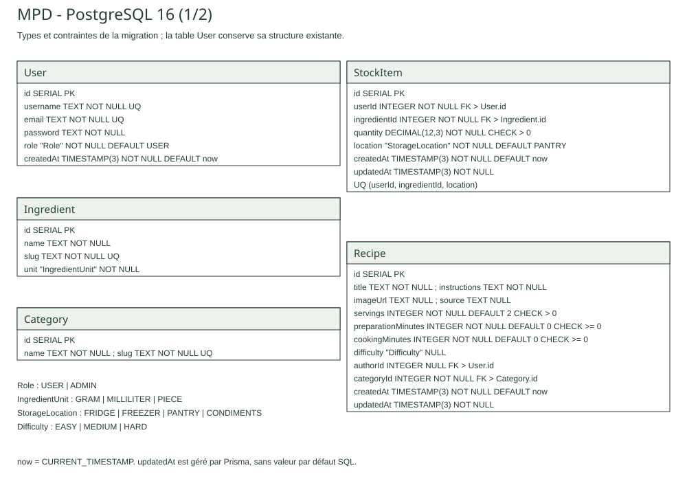
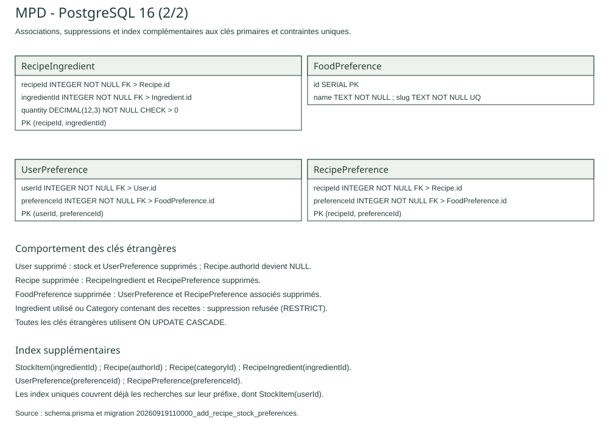

# Dossier projet Platinum

Julie Truc-Vallet · Formation Concepteur développeur d’applications · 3W Academy

Version de travail du 19 septembre 2026 · Préparation du dossier pour l’oral blanc

Platinum est une application web destinée à aider les utilisateurs à trouver quoi cuisiner avec les ingrédients qu’ils possèdent déjà. Le projet associe la gestion d’un stock personnel, un catalogue de recettes et des suggestions tenant compte des produits disponibles et des préférences alimentaires.

Cette version rassemble les éléments rédigés lors des deux premières semaines et les premières réalisations présentes dans le code. Les mentions « À compléter » identifient les travaux et preuves nécessaires avant la remise. Ce document n’est pas encore le dossier final.

## 1 Liste des compétences du référentiel couvertes par le projet

La présentation ci-dessous distingue les réalisations présentes, la conception préparée et les éléments qui restent à démontrer. Une réalisation codée ne constitue pas, à elle seule, une preuve de bon fonctionnement.

| Compétence | Éléments présents et emplacement dans le dossier | Preuve restant à apporter |
| --- | --- | --- |
| Installer et configurer son environnement de travail | Client React, serveur Express, Prisma et configuration Docker ; sections 6 et 7 | Procédure reproductible et vérification du démarrage |
| Développer des interfaces utilisateur | Maquettes Figma et client initialisé ; sections 5 et 7 | Écrans développés, reliés à l’API et testés |
| Développer des composants métier | Service d’authentification ; section 7 | Stock, recettes, préférences et suggestions vérifiés |
| Contribuer à la gestion d’un projet informatique | Tickets GitHub, tableau Kanban et historique ; section 4 | Suivi actualisé et bilan des écarts |
| Analyser les besoins et maquetter une application | Besoins, acteurs, droits et maquettes ; sections 2 et 5 | Corrections des diagrammes et adaptations aux supports |
| Définir l’architecture logicielle d’une application | Séparation client/serveur et responsabilités du serveur ; sections 5 et 6 | Schéma d’architecture et parcours détaillé d’une requête |
| Concevoir et mettre en place une base de données relationnelle | MCD, MLD, MPD et neuf tables PostgreSQL ; section 5 | Compléter avec le diagramme de classes et les contrôles des services |
| Développer des composants d’accès aux données SQL et NoSQL | Accès à PostgreSQL avec Prisma ; section 7 | Accès métier SQL et preuve NoSQL à identifier ou réaliser |
| Préparer et exécuter les plans de tests d’une application | Trame de scénarios ; sections 9 et 10 | Exécution, résultats et corrections |
| Préparer et documenter le déploiement d’une application | Environnement de développement décrit ; section 6 | Procédure de déploiement et vérifications |
| Contribuer à la mise en production dans une démarche DevOps | Travail suivi dans GitHub ; section 6 | Chaîne d’intégration et éléments de production à documenter |

À compléter : renvois aux figures et annexes définitives après réalisation et vérification des preuves.

## 2 Cahier des charges

### 2.1 Description de l’existant et problématique

De nombreux aliments présents dans les réfrigérateurs ou les placards ne sont pas utilisés faute d’idées de repas adaptées. Platinum répond à la question suivante : comment aider l’utilisateur à trouver quoi cuisiner avec les ingrédients qu’il possède afin de limiter le gaspillage alimentaire ?

L’objectif principal est de proposer des recettes pertinentes en fonction des ingrédients disponibles chez l’utilisateur. Celui-ci renseigne ses produits afin d’obtenir des suggestions réalisables immédiatement ou nécessitant un minimum de compléments. Cette approche vise à simplifier le choix des repas et à limiter les achats inutiles.

### 2.2 Reprise de l’existant

Le développement se poursuit à partir du dépôt Platinum existant. Il comprend un client React, un serveur Express, la configuration de Prisma et les premières fonctionnalités d’authentification. Les documents et maquettes des deux premières semaines servent de base à la conception détaillée. Aucune reprise de données provenant d’une application antérieure n’est décrite dans ces rendus.

### 2.3 Référencement et accès aux contenus

Les recettes publiques doivent pouvoir être consultées par un visiteur. La structure des pages devra distinguer clairement le titre de la recette, ses ingrédients et ses étapes. À compléter : objectifs de référencement retenus, titres et descriptions des pages, URLs, ainsi que les mesures effectivement mises en œuvre.

### 2.4 Performances et volumétrie

La recherche et les suggestions doivent permettre à l’utilisateur de trouver rapidement une recette. La conception doit également permettre l’évolution du catalogue. Aucun temps de réponse mesuré ni volume de référence n’est encore établi dans cette version. À compléter : taille du jeu de données, objectif de temps de réponse, conditions de mesure et résultats obtenus.

### 2.5 Publics et adaptations

Le projet s’adresse aux étudiants, jeunes actifs, familles et cuisiniers amateurs, ainsi qu’aux personnes sensibles à la réduction du gaspillage alimentaire. Les préférences alimentaires doivent permettre de personnaliser les résultats. Les contenus présentés sont en français ; une version multilingue n’est pas décrite dans le périmètre retenu.

L’application est pensée pour ordinateur, tablette et smartphone. L’approche mobile first répond notamment à un usage en cuisine. À compléter : vérifications de navigation clavier, de lisibilité, des contrastes et de comportement des formulaires.

### 2.6 Description graphique et ergonomique

Les maquettes Figma utilisent une identité visuelle autour du jaune, du vert, des aliments et du citron. Elles présentent un moteur de recherche, des cartes de recettes et des accès au profil et au stock. Le stock comporte des filtres tels que frigo, congélateur et placard. À compléter : palette et polices exactes, règles d’utilisation des composants, provenance des visuels et adaptation tablette.

### 2.7 Besoins fonctionnels métier

Trois profils sont distingués. Le visiteur découvre les recettes et effectue des recherches. L’utilisateur inscrit dispose d’un stock personnel et de préférences, et peut contribuer au catalogue. L’administrateur dispose de droits de gestion des contenus et des utilisateurs.

| Fonctionnalité attendue | Visiteur | Utilisateur inscrit | Administrateur |
| --- | --- | --- | --- |
| Consulter et rechercher des recettes publiques | Oui | Oui | Oui |
| Gérer son stock et ses préférences | Non | Oui | Oui |
| Recevoir des suggestions personnalisées | Non | Oui | Oui |
| Ajouter une recette | Non | Oui | Oui |
| Modifier ou supprimer ses recettes | Non | Oui | Oui |
| Administrer les utilisateurs et les contenus | Non | Non | Oui |

Cette matrice décrit les droits attendus. Leur implémentation complète et leurs tests restent à apporter. L’inscription et la connexion permettent d’accéder aux fonctions personnelles ; elles ne donnent pas de droits d’administration.

Les contenus comprennent les recettes, ingrédients, étapes de préparation, catégories et images. L’utilisation de données externes est envisagée mais n’est pas présentée ici comme réalisée. Les données de compte sont le nom d’utilisateur, l’adresse électronique et un mot de passe conservé sous forme hachée. Les modalités d’information et de gestion des données personnelles restent à concrétiser dans l’application.

Le périmètre retenu est celui des rendus de 2026 : comptes, rôles, stock, recettes, suggestions et préférences alimentaires. Les favoris, commentaires et listes de courses de l’ancien cahier des charges ne sont pas ajoutés à cette remise.

### 2.8 Budget

Le projet est réalisé individuellement dans le cadre de la formation. À compléter : temps consacré par phase, estimation du travail restant et coûts réels des services retenus. Les salaires et budgets de l’ancien document ne sont pas repris comme dépenses du projet actuel.

## 3 Présentation du contexte de formation

Platinum est réalisé dans le cadre de ma formation Concepteur développeur d’applications à 3W Academy. Je conçois et développe l’application individuellement. Le formateur définit les livrables attendus, évalue le travail remis et formule des retours sur lesquels je m’appuie pour améliorer le projet.

Le projet mobilise l’analyse des besoins, la conception des interfaces et des données, le développement d’une API et d’un client web, puis la vérification de leur fonctionnement. Il concerne les processus de gestion des comptes, de suivi des ingrédients disponibles, de consultation des recettes et de personnalisation des suggestions.

Les objectifs et les publics sont détaillés dans le cahier des charges. Aucune entreprise commanditaire ni équipe salariée fictive n’est ajoutée à ce contexte de formation.

## 4 Gestion de projet

### 4.1 Intervenants

J’assure l’organisation du projet, la conception, le développement et la réalisation des maquettes. Le formateur représente l’interlocuteur pédagogique et apporte des retours sur les livrables. Les visiteurs, utilisateurs inscrits et administrateurs représentent les futurs profils de l’application.

### 4.2 Méthodologie

Je m’appuie sur une démarche itérative : je découpe le projet en fonctionnalités, je les réalise progressivement et je vérifie les résultats obtenus. Je m’inspire des principes de Scrum pour organiser les périodes de travail et leurs objectifs. Le projet étant individuel, cette organisation ne reproduit pas l’ensemble des rôles et cérémonies d’une équipe Scrum.

### 4.3 Outils et suivi

J’utilise Git pour conserver l’historique des modifications et GitHub pour héberger le dépôt. GitHub Projects présente les tâches dans les colonnes À faire, En cours et Terminé. Les tickets existants suivent notamment la base de données, les rôles, le stock, les recettes, les suggestions, les préférences, les tests et le déploiement.

Le ticket #15 suit l’assemblage du dossier et les preuves des compétences. Les tickets #3, #10 et #11 précisent respectivement les critères de vérification de la base, des tests et de la préparation du déploiement. Une tâche doit rester ouverte tant que ses critères ne sont pas vérifiés.

| Période prévue | Résultat recherché |
| --- | --- |
| Samedi 19 septembre | Base du dossier et consolidation du modèle de données |
| Dimanche 20 septembre | Base métier, stock et recettes avec vérifications API |
| Lundi 21 septembre | Parcours React, suggestions et préférences |
| Mardi 22 septembre | Tests, sécurité, veille et consolidation des preuves |
| Mercredi 23 septembre | Relecture et préparation du PDF de remise |

Ce planning est prévisionnel. À compléter : travail réellement effectué, écarts et arbitrages, puis capture actualisée du tableau Projects. L’échéance annoncée de remise est le jeudi 24 septembre à 17 h ; mercredi constitue l’objectif interne.

### 4.4 Objectifs de qualité

Je recherche une interface compréhensible, des données cohérentes, des accès protégés et un code organisé par responsabilités. La vérification doit accompagner chaque fonctionnalité : réaliser, tester, conserver une preuve puis rédiger l’explication correspondante. Les objectifs de qualité doivent être associés à des résultats observables dans le plan de tests.

## 5 Spécifications fonctionnelles

### 5.1 Contraintes et livrables

L’application doit être utilisable sur plusieurs tailles d’écran et réserver les données personnelles aux utilisateurs autorisés. Les principaux livrables sont le code source, les modèles de données, les maquettes, les tests et le dossier. À compléter : disponibilité attendue, dépendances effectivement retenues et conséquences de l’indisponibilité d’un service externe.

### 5.2 Architecture logicielle

Le client React et TypeScript présente les interfaces. Le serveur Express reçoit les requêtes HTTP et expose l’API. Ses routes orientent les appels, ses middlewares vérifient les autorisations, ses contrôleurs traitent les échanges HTTP et ses services regroupent les traitements. Prisma assure les échanges avec PostgreSQL.

Le parcours d’authentification existant suit cette organisation : route, contrôleur, service puis accès aux données avec Prisma. La même séparation doit guider les composants métier restant à développer.

### 5.3 Maquettes et enchaînement

Les maquettes préparées dans Figma comprennent l’accueil, la connexion, l’inscription, les suggestions, le profil, l’ajout et le détail d’une recette. Un écran de stock présente les ingrédients disponibles et leur rangement. L’utilisateur découvre l’application depuis l’accueil puis se connecte pour accéder à ses fonctions personnelles.

À compléter : insérer les maquettes sélectionnées sur 3 à 4 pages, la cartographie et les règles d’adaptation des écrans. Les captures des rendus initiaux doivent être relues avant réutilisation ; elles ne remplacent pas les captures de l’application développée.

### 5.4 Modèle de données

Le modèle reprend les utilisateurs, ingrédients, recettes, catégories et préférences de la semaine 1. Il distingue maintenant les ingrédients du catalogue des lignes du stock personnel. Par exemple, le riz existe une fois dans le catalogue, mais plusieurs utilisateurs peuvent en posséder des quantités différentes et le ranger à plusieurs endroits.

Le MCD ci-dessous représente les informations métier et leurs associations. Une ligne de stock concerne un seul utilisateur et un seul ingrédient. Le triplet utilisateur, ingrédient et emplacement est unique. Une recette appartient à une catégorie et peut ne pas avoir d’auteur, notamment si elle provient d’une source externe ou si son auteur a supprimé son compte.

La relation Composer porte la quantité nécessaire pour le nombre de portions de la recette. Chaque ingrédient a une unité de référence : gramme, millilitre ou pièce. Les quantités du stock et des recettes utilisent cette même unité. Cette organisation évite de comparer directement des grammes et des kilogrammes ou de mélanger une masse et un volume. Les conversions de saisie restent à développer dans les services.

Le MLD traduit les associations en tables. RecipeIngredient relie une recette à ses ingrédients et porte leurs quantités. UserPreference et RecipePreference représentent les préférences choisies par les utilisateurs et celles compatibles avec les recettes. Leurs clés composées empêchent les doublons.

Le MPD précise les types PostgreSQL et les contraintes effectivement créées. Les quantités utilisent DECIMAL(12,3) et doivent être strictement positives. Les temps peuvent être nuls ; le nombre de portions doit être positif. Les champs facultatifs sont indiqués par NULL. Les identifiants des comptes existants et les champs d’authentification sont conservés.

Les suppressions tiennent compte du rôle des données : supprimer un utilisateur retire son stock et ses préférences, mais conserve ses recettes avec un auteur nul. La suppression d’un ingrédient utilisé est refusée. Supprimer une recette retire ses associations, sans retirer les ingrédients du catalogue.

Une recette exploitable doit contenir au moins un ingrédient : le MCD indique donc 1,n. Les clés étrangères SQL garantissent l’existence des références, mais ne forcent pas une recette à avoir une ligne dans RecipeIngredient. Cette règle devra être vérifiée lors de la création de la recette, dans une transaction. Le contrôle des droits sur les données personnelles reste lui aussi une responsabilité de l’API.

À compléter : diagramme de classes avec les contrôleurs et services, puis preuves de ces contrôles lors du développement des fonctionnalités.

### 5.5 Scripts de création et de modification

Deux migrations existent pour l’authentification. La première crée le type Role et la table User avec une contrainte d’unicité sur l’adresse électronique. La seconde remplace la colonne pseudo par username et crée une contrainte d’unicité sur username.

Cette seconde migration supprime une colonne puis ajoute une colonne obligatoire : sa présence dans l’historique ne démontre pas une reprise de données existantes. Son contexte initial reste à préciser.

La troisième migration, datée du 19 septembre 2026, ajoute les huit tables métier, leurs clés étrangères et leurs contraintes sans modifier les colonnes de User. Les contrôles CHECK sur les quantités, les portions et les durées sont ajoutés dans le script SQL, car ils ne sont pas exprimés par le schéma Prisma utilisé.

La migration a d’abord été exécutée sur une base PostgreSQL 16 isolée, après les deux migrations historiques et l’insertion d’un compte témoin. Toutes les valeurs de ce compte sont restées identiques. Après sauvegarde de la base locale de développement, la migration y a été appliquée ; la comparaison des comptes avant et après confirme également leur conservation. Les trois migrations sont à jour et le client Prisma a été régénéré.

Un script de démonstration contient six ingrédients et deux recettes. Son exécution deux fois sur la base de test n’a produit aucun doublon. Il ne crée pas de compte et n’a pas été chargé dans la base de développement. Les scripts et les résultats sont conservés dans le dépôt, avec la proposition de modification #16.

### 5.6 Diagramme de cas d’utilisation

Le diagramme global relie les profils aux fonctions décrites dans la matrice des droits. À compléter : reprendre le diagramme de semaine 1, vérifier le sens des relations include et distinguer les fonctions publiques des fonctions nécessitant une connexion.

### 5.7 Fonctionnalités détaillées

Renseigner ses ingrédients permet à l’utilisateur inscrit d’enregistrer les produits qu’il possède. Les informations à préciser sont l’ingrédient, la quantité, l’unité et, selon le modèle retenu, son emplacement. L’utilisateur ne doit agir que sur son propre stock.

Recevoir des suggestions permet de rapprocher ce stock des ingrédients nécessaires aux recettes. Le résultat doit présenter les recettes pertinentes et les ingrédients manquants. La règle de calcul et le traitement des préférences doivent être définis avant leur implémentation.

Rechercher des recettes par ingrédients permet une recherche manuelle sans dépendre exclusivement des suggestions personnelles. Les critères saisis, les contrôles et les résultats attendus doivent être précisés.

Consulter la compatibilité permet d’identifier les ingrédients disponibles et manquants pour une recette. Les indicateurs visuels préparés en semaine 1 ne constituent pas encore une règle de calcul complète. À compléter : seuils, gestion des quantités, unités compatibles et cas limites.

Pour ces quatre fonctionnalités, reprendre et corriger les diagrammes d’activité et de séquence, puis détailler les entrées, traitements, sorties et contrôles. Les séquences doivent rendre visibles les couches du serveur.

## 6 Spécifications techniques

### 6.1 Environnement technique

| Technologie présente | Utilisation dans Platinum |
| --- | --- |
| React, TypeScript et Vite | Initialisation du client et développement prévu des interfaces |
| Node.js, Express et TypeScript | Serveur et API organisés par responsabilités |
| PostgreSQL et Prisma | Stockage relationnel et accès aux données |
| bcrypt | Hachage et vérification des mots de passe |
| jsonwebtoken | Création et vérification des jetons d’authentification |
| Docker | Configuration de PostgreSQL dans l’environnement de développement |
| Git, GitHub et GitHub Projects | Versions et suivi des tâches |
| Figma | Conception des maquettes |

Ces choix reprennent les technologies travaillées pendant la formation et la séparation client/serveur décrite en semaine 2. À compléter : versions réellement installées, raisons de leur choix et contraintes. Les outils annoncés en semaine 1 mais non constatés dans le projet, tels que Swagger, Jest, Vitest ou Jenkins, ne sont pas présentés comme opérationnels.

### 6.2 Navigation et accessibilité

La cartographie doit être traduite en routes du client et en navigation utilisable sur mobile, tablette et ordinateur. À compléter : URLs réelles, gestion des pages protégées, messages d’erreur, compatibilité des navigateurs et résultats des vérifications d’accessibilité.

### 6.3 Services tiers et référencement

Les rendus envisagent des données externes pour compléter les ingrédients ou recettes. Aucun service de ce type n’est décrit comme intégré dans le code actuel. À compléter : décision sur leur utilisation, limites et gestion des erreurs. Les éléments de référencement réellement développés seront rattachés aux objectifs de la section 2.

### 6.4 Sécurité et configuration

Le serveur utilise des variables d’environnement pour sa configuration. Le secret JWT et l’URL de connexion à la base doivent être documentés par leur rôle, sans publier leurs valeurs. Les contrôles d’accès sont détaillés dans la section 8.

### 6.5 Préparation du déploiement et démarche DevOps

À compléter : prérequis, commandes de build et de démarrage, configuration de production, migrations, sauvegarde, restauration, contrôle du service et retour arrière. L’utilisation de GitHub pour le code ne constitue pas à elle seule une chaîne d’intégration ou de déploiement continu. Les opérations exécutées et leurs résultats seront distingués des étapes seulement préparées.

## 7 Réalisations

### 7.1 Organisation du projet

J’ai organisé le projet en deux dossiers : client pour l’interface et server pour l’API. Le serveur sépare routes, contrôleurs, services, middlewares et configuration. Le dossier Prisma contient le schéma de données et l’historique des migrations.

### 7.2 Inscription et connexion

J’ai développé les routes POST /api/auth/register et POST /api/auth/login. À l’inscription, le contrôleur transmet le nom d’utilisateur, l’adresse électronique et le mot de passe au service. Le service recherche un compte existant avec la même adresse ou le même nom, hache le mot de passe avec bcrypt puis crée le compte avec Prisma. La réponse contient l’identifiant, le nom, l’adresse et le rôle, sans le mot de passe haché.

Lors de la connexion, le service recherche le compte par son adresse électronique et compare le mot de passe transmis à son empreinte enregistrée. Si la comparaison réussit, il crée un JWT contenant l’identifiant et le rôle, avec une durée de validité d’une heure. Le service renvoie le jeton et les informations utiles du compte.

### 7.3 Contrôle des accès

J’ai ajouté un middleware qui récupère le jeton dans l’en-tête Authorization au format Bearer et vérifie sa validité. La route GET /api/auth/me l’utilise avant de renvoyer les informations décodées du jeton. Un second middleware vérifie que le rôle appartient aux rôles autorisés ; la route /api/auth/admin-test en fournit un premier exemple réservé à ADMIN.

À compléter : extraits lisibles du code correspondant, captures d’appels API et résultats de tests nominaux et refusés. Cette version décrit le code présent ; la vérification de son exécution doit encore être ajoutée.

### 7.4 Mise en place du modèle métier

Le schéma Prisma comprend maintenant neuf modèles. La migration crée les relations nécessaires au stock, aux recettes et aux préférences. Les contraintes et les suppressions ont été vérifiées avec 22 contrôles SQL réussis sur une base isolée. Cette étape vérifie la cohérence du stockage ; les routes métier et leur contrôle d’accès restent à développer.

Les fichiers de référence sont server/prisma/schema.prisma, la migration 20260919110000_add_recipe_stock_preferences, server/prisma/tests/constraints.sql et docs/verification-base-2026-09-19.txt. Les choix du modèle sont expliqués dans docs/modele-donnees.md et les trois niveaux de représentation figurent en section 5.4.

### 7.5 Réalisations métier et interfaces

À compléter après développement : stock personnel, catalogue de recettes, préférences et suggestions, puis interfaces React reliées à l’API. Pour chaque réalisation, présenter le besoin couvert, la capture réelle, le code significatif, l’argumentation et le résultat de vérification. Ajouter également les preuves des composants d’accès aux données SQL et NoSQL.

## 8 Éléments de sécurité de l’application

Le code actuel hache les mots de passe avec bcrypt et ne renvoie pas leur empreinte dans la réponse d’inscription. La connexion utilise une comparaison bcrypt et produit un JWT. Les middlewares permettent de refuser un accès sans jeton valide ou avec un rôle non autorisé.

Les rôles USER et ADMIN sont définis dans Prisma, avec USER comme valeur par défaut. Le rôle ne fait pas partie des champs transmis par la route d’inscription au service, ce qui évite de proposer l’attribution d’un rôle administrateur dans ce parcours.

À compléter et vérifier : validation des données d’entrée, gestion des erreurs, configuration des échanges avec le client, typage du contenu du JWT, gestion des secrets et droits sur les ressources personnelles. Chaque route de stock devra déterminer l’utilisateur à partir de son identité authentifiée et empêcher l’accès aux ressources d’un autre compte.

La présence d’une protection dans le code doit être accompagnée de tests. La section suivante prévoit notamment le refus d’un jeton absent ou invalide et les tentatives d’accès avec un rôle insuffisant.

## 9 Plan de tests

Le plan doit vérifier les fonctionnalités attendues et les refus nécessaires. Les données initiales, les actions, les résultats attendus et les résultats obtenus seront conservés pour rendre les vérifications reproductibles.

| Scénario préparé | Résultat attendu | État de la preuve |
| --- | --- | --- |
| Inscription avec données valides | Compte créé, rôle USER et absence du mot de passe dans la réponse | À exécuter et documenter |
| Adresse ou nom déjà utilisé | Création refusée | À exécuter et documenter |
| Connexion correcte puis incorrecte | Jeton dans le premier cas, refus dans le second | À exécuter et documenter |
| Route protégée sans jeton ou avec jeton invalide | Accès refusé | À exécuter et documenter |
| Route administrateur avec un compte USER | Accès refusé | À exécuter et documenter |
| Lecture ou modification du stock d’un autre compte | Accès refusé, données inchangées | Fonctionnalité à développer |
| Recette, stock et préférences cohérents | Suggestions conformes aux règles définies | Règles et fonctionnalité à compléter |
| Navigation sur plusieurs supports et au clavier | Contenus et actions utilisables | Interfaces à développer |

Le tableau ci-dessus reste un plan de vérification des parcours applicatifs. En complément, 22 contrôles ont été exécutés avec succès sur PostgreSQL 16 le 19 septembre 2026 : refus des quantités invalides et des doublons, respect des références, contrôles des portions et des temps, suppressions en cascade et conservation des recettes sans auteur. Les données de ce test ont été annulées par ROLLBACK. La trace d’exécution est conservée dans docs/verification-base-2026-09-19.txt.

Ces résultats ne démontrent pas encore la protection des routes HTTP, les conversions d’unités ou le calcul des suggestions. À compléter : tests unitaires et d’intégration pertinents, traces d’exécution des parcours, anomalies, corrections et vérification après correction.

## 10 Jeu d’essai de la fonctionnalité la plus représentative

La génération de suggestions à partir du stock est la fonctionnalité candidate, car elle représente l’objectif anti-gaspillage de Platinum et relie les données aux traitements et à l’interface.

À compléter une fois la règle métier arrêtée : créer des utilisateurs de test, des ingrédients, des recettes et des préférences ; fixer les résultats attendus ; exécuter les appels ; comparer les résultats obtenus aux attentes. Inclure une recette entièrement couverte, une recette partiellement couverte, un stock vide et une préférence excluant une recette.

Pour chaque cas, conserver les données d’entrée, la liste attendue, les valeurs calculées, les valeurs obtenues et la conclusion. Aucun résultat chiffré ni succès de test n’est inventé dans cette version.

## 11 Veille sur les vulnérabilités de sécurité

La veille doit porter sur les technologies effectivement utilisées dans Platinum et aboutir à des décisions vérifiables. Le guide veilleTechnique.md apporte une méthode de collecte et d’organisation, mais ne constitue pas le compte rendu d’une veille réalisée pour le projet.

À compléter : date de consultation, source, technologie et version concernées, risque recherché, résultat de l’analyse, décision et vérification d’un éventuel correctif. La rédaction finale devra décrire à la première personne les recherches réellement effectuées. L’absence de vulnérabilité confirmée ne doit pas être présentée comme une garantie de sécurité.

## Références et annexes à constituer

Documents de base : Projet Semaine 1 - Julie Truc-Vallet.pdf ; Projet Semaine 2 - Julie Truc-Vallet.pdf ; gabarit_dossier_projet (1).pdf ; référentiel CDA millésime 04 de 2023 fourni ; consignes et retours B3PROJET1 et B3PROJET2_1.

Dépôt : https://github.com/JulieTrucVallet/platinum

Suivi du dossier : https://github.com/JulieTrucVallet/platinum/issues/15

Maquettes : https://www.figma.com/design/35jm2eGMTuwXBFyl6bJNUF/Maquettes-Platinum

À constituer : modèles corrigés, diagrammes significatifs, captures des maquettes et des interfaces réelles, extraits de code, scripts de données et de migration, résultats de tests et références de veille. Les annexes doivent soutenir les explications du dossier et rester lisibles.
