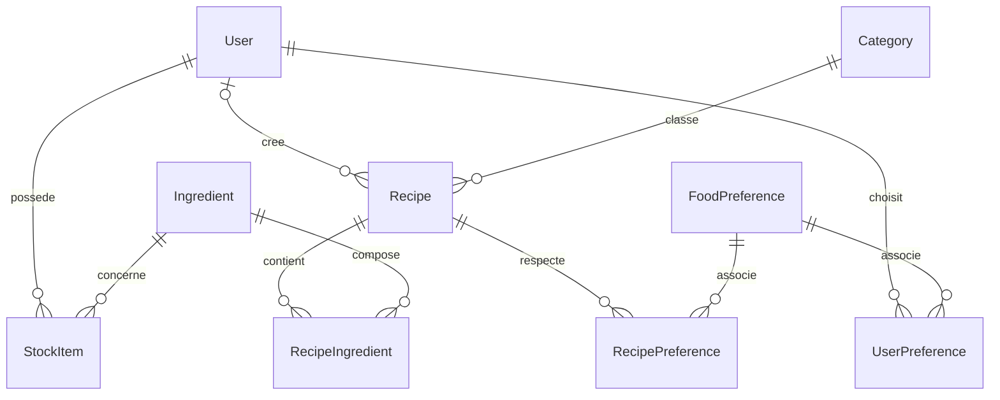

# Modèle de données Platinum

Version du 19 septembre 2026. Périmètre : rendus de 2026. Suivi : https://github.com/JulieTrucVallet/platinum/issues/3

## Besoin couvert

La base relationnelle doit permettre de gérer les comptes, le stock personnel, les recettes, les catégories et les préférences alimentaires. Elle prépare les suggestions à partir des quantités disponibles. Le modèle prolonge celui de la semaine 1 et conserve les champs du modèle User déjà utilisés par l’authentification.

## Règles de gestion retenues

1. Un utilisateur possède zéro à plusieurs lignes de stock. Une ligne appartient à un seul utilisateur et concerne un seul ingrédient.
2. Le catalogue Ingredient est partagé. Il décrit le produit, pas la quantité possédée. Le slug unique identifie l’ingrédient indépendamment du libellé affiché. L’API devra produire ce slug de façon normalisée.
3. Un même ingrédient peut être présent dans plusieurs emplacements d’un utilisateur. Le triplet utilisateur, ingrédient, emplacement est unique. La route POST refuse un doublon avec HTTP 409 ; PATCH remplace explicitement la quantité totale de la ligne existante.
4. Une quantité doit être strictement positive. Un stock épuisé est représenté par la suppression de sa ligne. Les quantités utilisent Decimal(12,3), évitant les approximations des nombres flottants binaires ; l’API du stock refuse une précision supérieure à trois décimales et les valeurs hors plage avant insertion. Ce contrôle reste à appliquer aux recettes.
5. Chaque ingrédient possède une unité de référence : gramme, millilitre ou pièce. StockItem.quantity et RecipeIngredient.quantity utilisent cette même unité. L’API du stock convertit les kilogrammes et litres en grammes et millilitres à l’entrée. La même règle reste à appliquer aux recettes ; l’affichage pourra ensuite reformater ces valeurs. On ne convertit pas une masse en volume sans information spécifique. L’unité d’un ingrédient utilisé devra être protégée contre les modifications incohérentes par l’API.
6. Les emplacements reflètent la maquette : FRIDGE, FREEZER, PANTRY et CONDIMENTS. CONDIMENTS est ici une zone de rangement fonctionnelle, pas une catégorie de recette. La vue « Tout » est un filtre, pas un emplacement stocké.
7. Une recette appartient à une catégorie. Elle possède zéro ou un auteur, pour permettre une recette externe ou conserver une recette après suppression de son auteur. Les administrateurs gèrent les recettes sans auteur ; l’absence d’auteur ne doit pas ouvrir leur modification à tous.
8. Une recette exploitable possède au moins un ingrédient. Le couple recette/ingrédient est unique ; la quantité concerne le nombre de portions indiqué dans Recipe.servings. La création complète d’une recette devra être transactionnelle. La présence d’au moins une ligne est à vérifier dans le service, car une simple clé étrangère ne l’impose pas.
9. Les temps de préparation et de cuisson sont exprimés en minutes et doivent être positifs ou nuls. Le nombre de portions est strictement positif. La difficulté est facultative ; une difficulté inconnue n’est pas automatiquement qualifiée de facile.
10. Un utilisateur peut choisir plusieurs préférences et une recette peut être compatible avec plusieurs préférences. Les tables d’association ont des clés composées pour interdire les doublons. Les préférences ne constituent pas une garantie médicale sur les allergènes.
11. La suppression d’un utilisateur supprime son stock et ses associations de préférences. Ses recettes sont conservées avec un auteur nul. La suppression d’une recette supprime ses ingrédients associés et ses préférences, sans supprimer le catalogue.
12. La suppression d’un ingrédient utilisé ou d’une catégorie contenant des recettes est refusée. La suppression d’une préférence retire ses associations. Cette opération devra être réservée à l’administration.

## Correspondance avec la semaine 1

| Élément initial | Modèle Prisma | Évolution |
| --- | --- | --- |
| User | User | Champs existants conservés ; relations ajoutées |
| Ingredient | Ingredient | Ajout d’un slug unique et de l’unité de référence |
| has / user_ingredient | StockItem | Identifiant propre, emplacement et unicité du triplet |
| Recipe | Recipe | Portions, temps distincts, difficulté facultative et auteur facultatif |
| contains / recipe_ingredient | RecipeIngredient | Quantité de référence et clé composée |
| Category | Category | Slug unique |
| Food preference | FoodPreference | Slug unique |
| prefers / user_preference | UserPreference | Clé composée utilisateur/préférence |
| matches / recipe_preference | RecipePreference | Clé composée recette/préférence |

L’unité n’est plus répétée dans les deux associations : elle dépend de l’ingrédient. Cela évite qu’une même quantité soit interprétée différemment dans le stock et dans une recette. Les unités de saisie restent une responsabilité de l’interface et du service de conversion.

## Relations et cardinalités

Les modèles corrigés sont disponibles en [PDF](diagrammes/Platinum_modeles_donnees.pdf) et en SVG :

- [MCD conceptuel](diagrammes/mcd.svg) : entités, associations et cardinalités métier, sans clés étrangères.
- [MLD relationnel](diagrammes/mld.svg) : neuf relations, clés primaires, clés étrangères et unicité.
- [MPD, tables principales](diagrammes/mpd-1.svg) et [MPD, associations et contraintes](diagrammes/mpd-2.svg) : PostgreSQL 16 et migration appliquée.

Les SVG sont des sources vectorielles modifiables. Les clés étrangères du MLD et du MPD indiquent explicitement la table et la colonne référencées. Le diagramme Mermaid suivant est une vue relationnelle complémentaire ; il représente les cardinalités permises par la structure SQL.



La cardinalité zéro à plusieurs de RecipeIngredient décrit ce que la structure SQL seule autorise. La règle métier plus stricte « une recette exploitable a au moins un ingrédient » doit être imposée par le service. Dans le MCD métier, représenter cette exigence et expliquer la différence avec la contrainte physique.

## Contraintes physiques

Les identifiants et clés étrangères sont générés par la migration Prisma. Les clés composées et contraintes uniques évitent les associations répétées. Les index sur les clés étrangères facilitent les recherches par catégorie, auteur, ingrédient ou préférence. Le préfixe userId de l’index unique du stock sert également aux recherches du stock d’un utilisateur.

Les contraintes CHECK sur les quantités, temps et portions sont ajoutées explicitement au SQL de migration : elles ne sont pas décrites par le langage du schéma Prisma 6 utilisé ici. Elles doivent être conservées dans les migrations futures et vérifiées par les tests PostgreSQL.

Les noms, titres et instructions doivent également être validés dans les services. Les contraintes relationnelles ne remplacent ni l’authentification ni le contrôle de propriété d’une ressource.

## Suggestions et préférences

Le modèle permet de sommer les quantités d’un ingrédient sur plusieurs emplacements et de les comparer aux quantités d’une recette pour son nombre de portions. Les associations de préférences permettent ensuite le filtrage. Le score, ses seuils et la politique exacte de combinaison des préférences seront définis dans le ticket #7 avant le développement du calcul. Aucun score n’est stocké prématurément dans PostgreSQL.

## Migration et vérification

La migration métier ajoute les tables et contraintes sans supprimer ni modifier les colonnes existantes de User. Les anciennes migrations restent inchangées. La migration historique pseudo vers username n’est pas réécrite : elle fait partie de l’historique déjà utilisé.

Avant application à la base de développement, vérifier son état de migration et disposer d’une sauvegarde. Le test doit d’abord partir d’une base séparée, appliquer les migrations historiques, ajouter un utilisateur témoin puis appliquer la nouvelle migration. Cet utilisateur doit rester présent et inchangé.

Le fichier prisma/tests/constraints.sql prépare les scénarios relationnels et les cas refusés. Il exécute ses données dans une transaction annulée à la fin. Le fichier prisma/demo.sql alimente uniquement le catalogue avec des données identifiées comme exemples ; il ne crée pas de compte et ne donne aucun droit administrateur.

## Texte pour le dossier

J’ai distingué les ingrédients du catalogue des quantités détenues par chaque utilisateur. La table StockItem représente l’association entre un utilisateur et un ingrédient, complétée par l’emplacement de rangement. Une contrainte unique empêche de créer deux lignes pour le même ingrédient au même emplacement chez un utilisateur. Les quantités sont stockées dans une unité de référence définie sur l’ingrédient, ce qui permet de comparer le stock et les besoins des recettes sans mélanger grammes, litres et pièces.

J’ai modélisé la composition des recettes avec RecipeIngredient, qui relie une recette à un ingrédient et porte la quantité nécessaire pour le nombre de portions de la recette. Les préférences sont reliées séparément aux utilisateurs et aux recettes par deux tables d’association. Cette organisation évite de répéter les préférences dans des champs de texte et permet de filtrer les recettes en s’appuyant sur des relations explicites.

Les résultats réellement obtenus sont détaillés ci-dessous. Les modèles Merise sont intégrés à la section 5.4 du [dossier en cours](dossier/Dossier_Platinum_base.pdf). Le diagramme de classes, les séquences et les activités restent à reprendre dans le ticket #15, avec les contrôleurs et services effectivement développés.

## Vérifications effectuées le 19 septembre 2026

- Prisma 6.19.3 : formatage et validation du schéma réussis.
- PostgreSQL 16 dans un conteneur isolé : les deux migrations historiques puis la migration métier ont été exécutées avec succès.
- Un compte témoin inséré avant la migration métier a conservé toutes ses colonnes, y compris le mot de passe et la date de création.
- 22 vérifications PostgreSQL réussies : quantités et temps invalides, doublons, clés étrangères, suppressions en cascade, conservation des recettes sans auteur et maintien du stock de l’autre utilisateur lors d’une suppression de compte.
- Les données du test de contraintes ont été annulées par ROLLBACK.
- Le catalogue de démonstration a été chargé deux fois : 6 ingrédients, 2 recettes, 5 associations recette/ingrédient, 2 préférences et 2 associations recette/préférence, sans doublon ni création de compte.

Ces tests ne prouvent pas encore la protection des routes API ni le calcul des suggestions, qui restent à développer et tester.

## Commandes de travail depuis le dossier server

Après sauvegarde et vérification de la base ciblée par DATABASE_URL :

```powershell
npx prisma validate
npx prisma migrate status
npx prisma migrate deploy
npx prisma generate
npx tsc --noEmit
```

Le catalogue de démonstration est facultatif, réservé à l’environnement de développement :

```powershell
npx prisma db execute --file prisma/demo.sql --schema prisma/schema.prisma
```

Le test prisma/tests/constraints.sql doit être exécuté sur une base PostgreSQL de test avec psql et l’option ON_ERROR_STOP=1. Il ne doit pas être exécuté en production ; même une transaction annulée peut consommer des valeurs de séquences.

## Application à la base de développement

La cible locale a été vérifiée par rapport au conteneur PostgreSQL Platinum. Une sauvegarde au format pg_dump personnalisé a été créée et son catalogue a été lu avec pg_restore. La migration métier a ensuite été appliquée avec Prisma migrate deploy. La comparaison des comptes avant et après migration confirme que leurs valeurs sont inchangées. Le client Prisma a été régénéré et la compilation TypeScript du serveur a réussi. Prisma indique que les trois migrations sont à jour. Le catalogue de démonstration reste facultatif et n’a pas été chargé dans cette base de développement.

## Évolution du stock le 20 septembre 2026

Le CRUD du stock et la recherche du catalogue sont maintenant exposés par l’API : [contrat](api-stock.md), [fiche de compréhension](Comprendre_le_stock.md) et [29 tests HTTP réussis](verification-stock-2026-09-20.txt). Les contraintes du modèle n’ont pas changé. Le contrôle de propriété, les conversions et le refus des doublons sont vérifiés. Les règles de création des recettes et de suggestions restent à implémenter.
